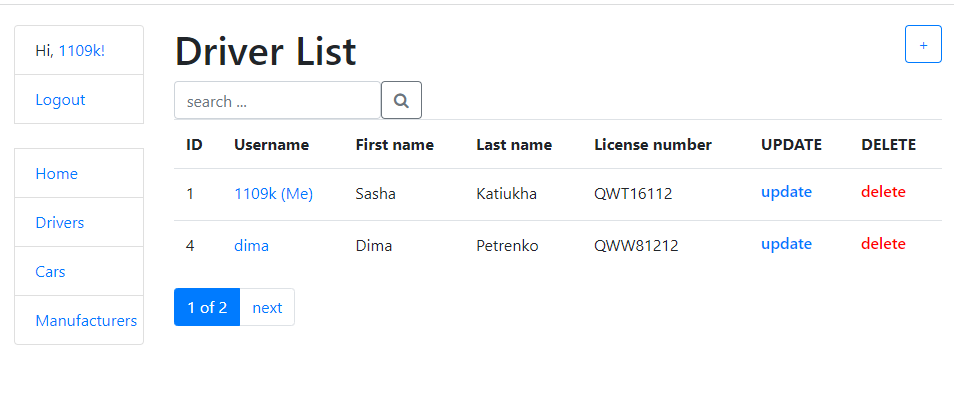

# Taxi

Django project for managing cars, drivers, manufacturers in taxi service

## Check it out!

[project on heroku](https://taxi-servise.herokuapp.com/)

* username:user
* password:1234User

## Installing / Getting started

Python 3 must be already installed

```shell
git clone https://github.com/KatiukhaO/taxi
cd taxi
python -m venv venv
venv/scripts/activate
pip install -r requirements.txt
python manage.py runserver  # start Django project
```

## Features

* Authentication functionality for Driver/User
* Managing cars, drivers, manufacturers directly from website
* Admin panel for advanced managing

## Demo




